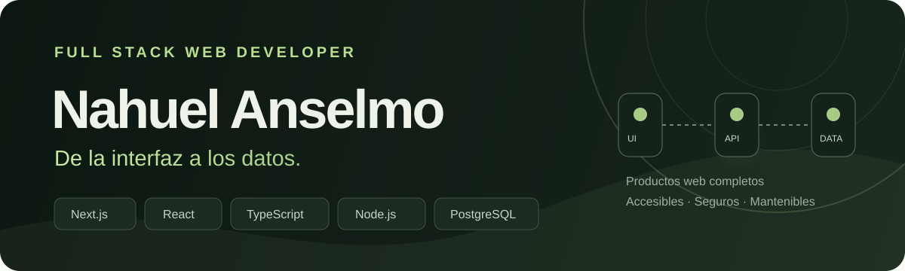

  

  
  
  
  

  Construyo aplicaciones web completas: interfaces claras, APIs mantenibles y datos confiables. 
  Vivo en <strong>San Miguel de Tucumán, Argentina</strong> y estoy abierto a oportunidades frontend, backend y full stack.

## Sobre mí

| En qué trabajo | Cómo lo encaro | Qué busco |
| :--- | :--- | :--- |
| Productos web de punta a punta | Código tipado, componentes reutilizables y responsabilidades claras | Resolver problemas reales con experiencias simples |
| Interfaces responsive y accesibles | Diseño adaptable, estados claros y navegación por teclado | Equipos donde pueda aportar y seguir creciendo |
| APIs, autenticación y persistencia | Reglas de negocio, control de acceso y datos consistentes | Oportunidades presenciales o remotas |

## Proyecto destacado · Agenda Local

**Agenda Local** es una plataforma de turnos para comercios de servicios. Conecta la reserva online del cliente con la operación diaria del negocio, incluso cuando los turnos también llegan por WhatsApp, teléfono o de manera presencial.

<table>
  <tr>
    <td width="25%" align="center">
      <strong>Reserva pública</strong>  
      Servicio, profesional, fecha y horario disponibles.
    </td>
    <td width="25%" align="center">
      <strong>Panel del negocio</strong>  
      Métricas, filtros, turnos, servicios, equipo y horarios.
    </td>
    <td width="25%" align="center">
      <strong>Acceso por roles</strong>  
      El propietario ve todo y cada profesional gestiona su agenda.
    </td>
    <td width="25%" align="center">
      <strong>Datos consistentes</strong>  
      Protección contra horarios superpuestos y pedidos duplicados.
    </td>
  </tr>
</table>

### Arquitectura

<table>
  <tr>
    <td align="center"><strong>Cliente</strong> Reserva y panel responsive</td>
    <td align="center">→</td>
    <td align="center"><strong>Next.js + React</strong> Interfaz y experiencia</td>
    <td align="center">→</td>
    <td align="center"><strong>Express API</strong> Autenticación y negocio</td>
    <td align="center">→</td>
    <td align="center"><strong>Prisma + PostgreSQL</strong> Persistencia y concurrencia</td>
  </tr>
</table>

  
  
  

## Tecnologías

  
  
  
  
  

  
  
  
  
  

  
  
  
  

## Más proyectos

| Proyecto | Lo que resuelve | Tecnologías | Enlaces |
| :--- | :--- | :--- | :--- |
| **Portfolio profesional** | Presenta mi trabajo con contenido tipado, SEO, accesibilidad, diseño responsive y temas. | Next.js · TypeScript · Tailwind CSS · Playwright | [Web](https://nahuel-anselmo-portfolio.vercel.app) · [Código](https://github.com/NahuelAnselmo/portfolio) |
| **Gestor de tareas** | Permite registrarse, iniciar sesión y administrar tareas con datos aislados por usuario. | React · Node.js · Express · MongoDB | [Frontend](https://github.com/NahuelAnselmo/client-tasks-crud) · [Backend](https://github.com/NahuelAnselmo/server-tasks-crud) |
| **La Cervecería** | Catálogo, carrito y administración para un e-commerce desarrollado en equipo. | React · Node.js · MongoDB · Bootstrap | [Frontend](https://github.com/NahuelAnselmo/LaCerveceria-Front) · [Backend](https://github.com/NahuelAnselmo/LaCerveceria-Back) |

## Actividad en GitHub

  
  

## Formación

Me formé en **Desarrollo Web Full Stack en RollingCode School**. Continúo profundizando en arquitectura, seguridad, testing y despliegue para convertir ideas en productos web que puedan crecer.

  <strong>¿Tenés una oportunidad o un proyecto en mente?</strong> 
  <a href="mailto:nahuelanselmo63t@gmail.com">nahuelanselmo63t@gmail.com</a>

